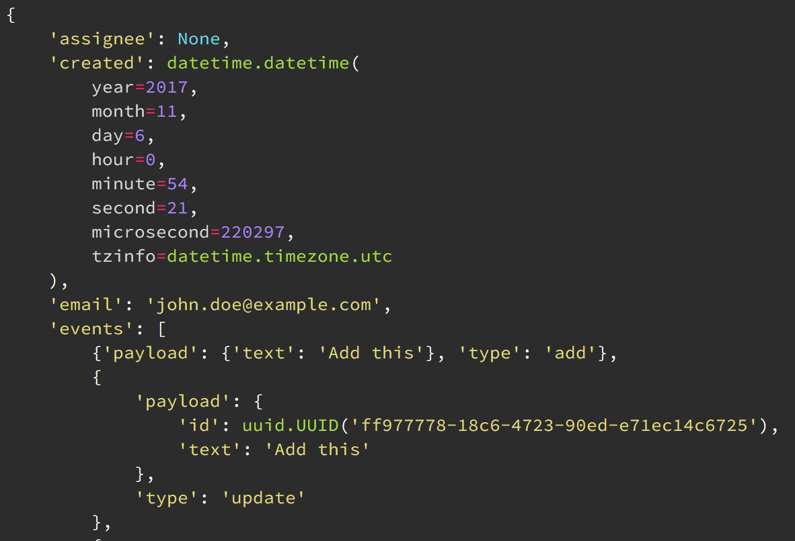

Drop in replacement for pprint with prettier, opinionated (but PEP8 compliant) output.

Usage
-----

This package is not available on PyPi yet. Install directly from the repo:

.. code:: bash
    
    pip install -e git+https://github.com/tommikaikkonen/peprint.git#egg=peprint

Then, instead of

.. code:: python

    from pprint import pprint

do

.. code:: python

    from peprint import pprint

Usage with IPython
------------------

You can use peprint with IPython so that values in the REPL will be printed with ``peprint`` using syntax highlighting. You need to call ``peprint`` initialization functions at the start of an IPython session, which IPython facilitates with `profile startup files`_. To initialize peprint in your default profile, add and edit a new startup file with the following commands:

.. code:: bash
    
    touch "`ipython locate profile default`/startup/init_peprint.py"
    nano "`ipython locate profile default`/startup/init_peprint.py"

The code in this file will be run upon entering the shell. Then add one or more of these lines:

.. code:: python

    # Use peprint as the default pretty printer in IPython
    import peprint.extras.ipython

    peprint.extras.ipython.install()

    # Specify syntax higlighting theme in IPython;
    # will be picked up by peprint.
    from pygments import styles

    ipy = get_ipython()
    ipy.colors = 'linux'
    ipy.highlighting_style = styles.get_style_by_name('monokai')

    # For Django users: install prettyprinter for Django models and QuerySets.
    import peprint.extras.django
    peprint.extras.django.install()

Packages colorful_ and pygments_ need to be installed to use ``peprint`` with ``IPython``.

Pretty printing your own types
------------------------------

Given a custom class like this:

.. code:: python

    class MyClass(object):
        def __init__(self, one, two):
            self.one = one
            self.two = two

You can register a pretty printer like this:

.. code:: python

    from peprint import register_pretty, prettycall

    @register_pretty(MyClass)
    def pretty_myclass(value, ctx):
        return prettycall(
            ctx,
            MyClass,
            one=value.one,
            two=value.two
        )

To get an output like this with simple data:

.. code:: python
    
    >>> peprint.pprint(MyClass(1, 2))
    MyClass(one=1, two=2)

The real utility is in how nested data pretty printing is handled for you, and how the function call is broken to multiple lines for easier legibility:

.. code:: python
    
    >>> peprint.pprint(MyClass({'abc': 1, 'defg': 2, 'hijk': 3}, [1, 2]))
    MyClass(
        one={
            'abc': 1,
            'defg': 2,
            'hijk': 3
        },
        two=[1, 2]
    )

:func:`@register_pretty <peprint.register_pretty>` is a decorator that takes the type to register. Internally, :class:`functools.singledispatch` is used to handle dispatch to the correct pretty printer. This means that any subclasses will also use the same printer.

The decorated function must accept two arguments:

- ``value`` to pretty print, and
- ``ctx``, a context value.

In most cases, you don't need need to do anything with the context except pass it along in calls, but it can be used to affect rendering of nested data.

The function must return a :class:`~peprint.doc.Doc`, which is either an instance of :class:`~peprint.doc.Doc` or a :class:`str`. :func:`~peprint.prettycall` returns a :class:`~peprint.doc.Doc` that represents a function call. Given an arbitrary context ``ctx``

.. code:: python

    prettycall(ctx, round, 1.5)

Will be printed out as

.. code:: python

    round(1.5)

with syntax highlighting.

.. _`profile startup files`: http://ipython.readthedocs.io/en/stable/config/intro.html#profiles
.. _colorful: https://github.com/timofurrer/colorful
.. _pygments: https://pypi.python.org/pypi/Pygments